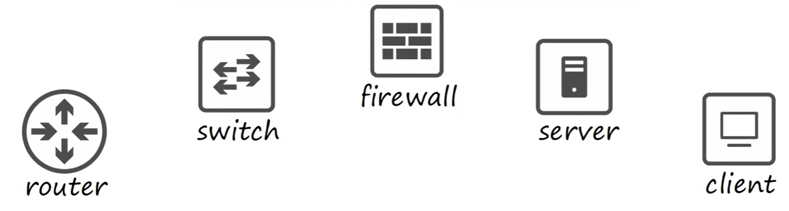
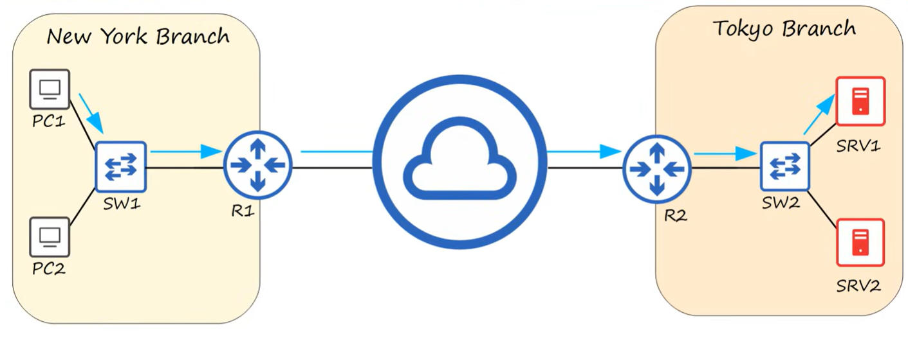

# Network Devices

A computer network is digital telecommunications network which allows nodes to share resources

## Clients and Servers

A client is a device which accesses a service made available by a server

A server is a device that provides functions or services for clients

## Switches

Switches are used to forward traffics within a LAN (Local area network). Devices connected to a switch all reside on the same LAN. The hosts within each LAN can send data to eachtother, howevever they cannot send data between LANS.

Switches:
* Have many network interfaces/ports for end hosts to connect to (usually 24+)
* Provide connectivity to hosts within the same LAN
* Do not provide connectivity betwen LANS/over the internet

## Router

Routers allow LANs to communicate to eachother. When a host wants to send data to another lan, it first sends it to it's router, which then forwards it to the other LAN's router.

* Have fewer network interfaces than switches
* Are used to provide connectivity between LANs
* Are used to send data over the internet

## Firewalls

Firewalls can be placed outside your router, or within the LAN.

Firewalls are configured with security rules to allow or deny traffic.

* monitor and control network traffic based on configured rules
* Can be placed inside the network, or outside the network

Netowork firewalls are hardware devices that filter networks between networks. There are also host based firewalls that are software applications that filter traffic entering and exiting a host machine, like a PC.