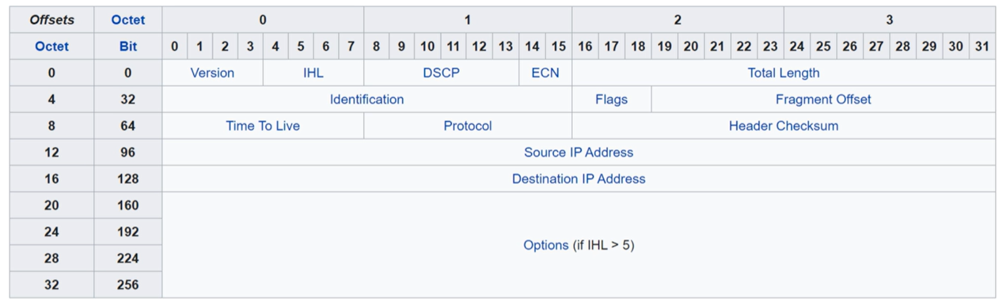

# IPv4 Header

## PDUs

### Version
* 4 bits
* Identifies version of ip used
* IPv4 = 4 = 0100
* IPv6 = 6 = 0110

### Internet Header Length (IHL)
* 4 bits
* Final field of IPv4 Header is vaiable length, so this indicates the total length of the header
* Identifies the header length in 4-byte increments
* If the vlaue is 5, then the header length is 5 * 4 bytes = 20 bytes.
* Minimum value is 5
* Maximum value is 15 (60 bytes)

### DSCP - Differentiated services code point
* Length 6 bits
* Used for quality of service (QoS)
* Used to prioritize delay sensitive data (streaming voice, video etc)

### ECN - Explicit congestion notification

* Length 2 bits
* Provides end to end notification of network congestion without dropping packets
* Optional field which requires both endpoints as well as the network to support it

## Total length field
* 16 bits
* Total length of the packet (L3 header + L4 segment (header + data))
* Measured in bytes, not 4-byte increments
* Minimum value is 20
* Maxmimum value is 65,535 (maximum 16 bit value)

### Identification field

* If a packet is fragmented due to being too large, this field is used to identify the fragment it belongs to.
* All fragments of the same packet have their own IPv4 header with the same value in this field
* Packets are fragmented if larget than the maximum transmission unit (MTU)
* The MTU is usually 1500 bytes
* Fragments are reassembled by the receiving hosts

### Flags field
* 3 bits
* Used to control/identify fragments
* Bit 0: reserved always set to 0
* Bit 1: dont fragment (used to indicate to not fragment)
* Bit 2: More fragments (MF), set to 1 if there are more fragments in the packet, set to 0 in the last fragment

### Fragment offset field
* Used to indicate the position of the fragment within the original unfragmented ip packet
* Allows the fragmented packets to be rearranged in order even when the packets arrive out of order

### Time to live field
* 8 bits
* A router will drop a packet with a TTL of 0
* Used to prevent infinite loops
* Originally designed to indicate the packets maximum lifetime in seconds
* In practice, indicates a hop count each time the packet arrives at a router, the router increases the TTL by 1
* Recommended default TTL is 64

### Protocol field 
* 8 bits
* Indicates the protocol of the L4PDU
* 6: TCP
* 17: UDP
* 1: ICMP (ping)
* 89: OSPF (dynamic routing protocol)

### Header checksum field
* 16 bits
* Calculated checksum used to check for errors in the ipv4 header
* When a router receives a packet, it calculates the checksum of the header and compares to this field
* If they do not match, the router drops the packet

### Source/Desintaiton IP address fields
* 32 bits each
* Source = Ipv4 of the sender
* Destination = ipv4 of the intented receiveer

### Options
* Length: 0 - 320 bits
* Rarely used
* if the IHL is greater than 5, options are present
