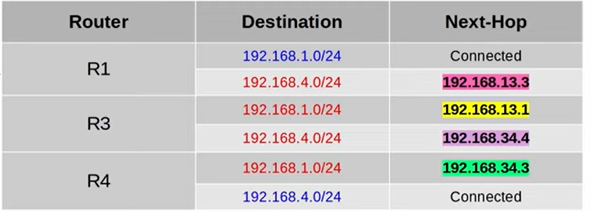

# Routing Fundamentals

## What is routing?

* Routing is the process that routers use to determing the path that ip packets should take over a network
* Routers store routes to all their known destinations in a routing table
* When routers receive packets, they look into the routing table to find the best route to forward that packet
* There are two main routing methods:
    * Dynamic routing: dynamic routing protocols automatically share and build their routing tables
    * Static routing: Manually configured routing table
* A route tells the router:
    * To send a packet to destination X, you should send the packet to next-hop Y (The next router in the path ot the destination).
    * Or, if the destination is connected to the router, send the packet directly
    * Or, if the packer is the routers own IP address, receive it for yourself (dont forward)


## Connected and Local Routes

* (L) Local route is to the routers own IP address
* (C) A connected route  is a route to the network the interface is connected to with the netmask configured on the interface

```
show ip route
```


## Route Selection

If a packet matches multiple routes (i.e. local route 192.168.1.1/32 and connected route 192.168.1.0/24) it will choose the most specific matching route.

# Static Routing

## Default Gateway


* End hosts like PC1 and PC4 can send packets directly to destinations in their connected networks
    * PC1 is connected to 192.168.1.0/24
    * PC2 is connected to 192.168.4.0/24
* To send packets to outside their local network, they must send packets to their default gateway (router)

* The default gateway configuration is also called a default route.
    * It is a route to 0.0.0.0/0. All netmask bits set to 0, includes all addresses from 0.0.0.0 to 255.255.255.255
    * It is the least specific route possible (unlike a /32 route, which is the most specific only specifying one ip address)
* End hosts usually have no need for more specific routes
    * They just need to know to send packets outside their local network, to send them to the default gateway


If PC1 wants to send a packet to PC4, the src ip is 192.168.1.10 and the destination ip is 192.168.4.10. The destination MAC is R1's G0/2 MAC and the source MAC is PC1 eth0 MAC. To learn R1's G0/2 MAC address, PC1 will first send an ARP request ot 192.168.1.1.

## Static routes
* when R1 recieves the frame from PC1, it will de-encapsulate it (remove L2 header/trailer) and look at the packet
* It will check the routing table for the most specific matching route
* R1 has no matching routes in is routing table
    * it will drop the packet
* To properly forward the packet, R1 needs a route to the destination network (192.168.4.0/24)
* There are two possible paths it can take:
    * PC1 -> R1 -> R3 -> R4 -> PC4
    * PC1 -> R1 -> R2 -> R4 -> PC4
* It is possible to configure the router to load balance between path 1 and path 2, or to use path 1 as the main path and path 2 as a backup

## Configuration

* Each router in the path needs to routes
    * A route to PC1's network and a route to PC4's network.
    * This ensures two way reachability
* R1 Already has a connected route to 192.168.1.0/24, and R4 has a CR to 192.168.4.0/24



## Static route configuration

To create a static route:
```
ip route ip-address netmask next-hop
```
For example for R3:
```
ip route 192.168.1.0 255.255.255.0 192.168.13.1
ip route 192.168.4.0 255.255.255.0 192.168.34.4
```

## PC1 <-> PC4


## Static route configuration with exit interface
Instead of specifying the IP address of the next hop, you can specify the interface to exit out of
```
ip route ip-address netmask exit-interface
```
If R2 wants to send a packet to the 192.168.1.0/24 network, it should send it to R1.
```
ip route 192.168.1.0 255.255.255.0 g0/0
```
You can specify both the exit interface and the next hop

* Static routes which you specify only the exit-interface rely on a feature called Proxy ARP to function
* This is usually not a problem, but generally you can stick to next-hop or exit-interface next-hop
* Neither is better than the other, it is up to preference

## Default route

```
ip route 0.0.0.0 0.0.0.0 203.0.113.2
```


## Commands

Show route table:
```
R1(config)#do sh ip rou
Codes: L - local, C - connected, S - static, R - RIP, M - mobile, B - BGP
       D - EIGRP, EX - EIGRP external, O - OSPF, IA - OSPF inter area
       N1 - OSPF NSSA external type 1, N2 - OSPF NSSA external type 2
       E1 - OSPF external type 1, E2 - OSPF external type 2, E - EGP
       i - IS-IS, L1 - IS-IS level-1, L2 - IS-IS level-2, ia - IS-IS inter area
       * - candidate default, U - per-user static route, o - ODR
       P - periodic downloaded static route

Gateway of last resort is not set

     192.168.1.0/24 is variably subnetted, 2 subnets, 2 masks
C       192.168.1.0/24 is directly connected, GigabitEthernet0/1
L       192.168.1.254/32 is directly connected, GigabitEthernet0/1
S    192.168.3.0/24 [1/0] via 192.168.12.3
     192.168.12.0/24 is variably subnetted, 2 subnets, 2 masks
C       192.168.12.0/24 is directly connected, GigabitEthernet0/0
L       192.168.12.1/32 is directly connected, GigabitEthernet0/0
```

Show interface IP addresses:
```
R3(config)#do sh ip int brief
Interface              IP-Address      OK? Method Status                Protocol 
GigabitEthernet0/0     192.168.23.3    YES manual up                    up 
GigabitEthernet0/1     192.168.3.254   YES manual up                    up 
GigabitEthernet0/2     unassigned      YES unset  administratively down down 
Vlan1                  unassigned      YES unset  administratively down down
```

Modify an interface's ip address:
```
R3(config)#int g0/0
R3(config-if)#ip addr 192.168.13.3
% Incomplete command.
R3(config-if)#ip addr 192.168.13.3 255.255.255.0
```