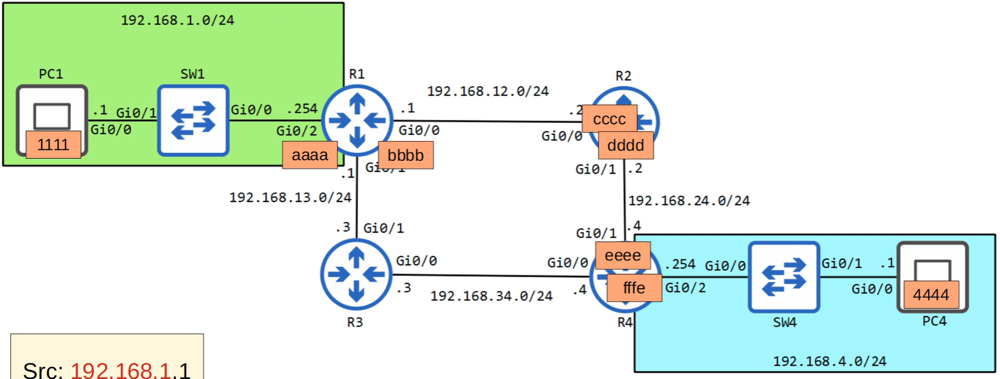
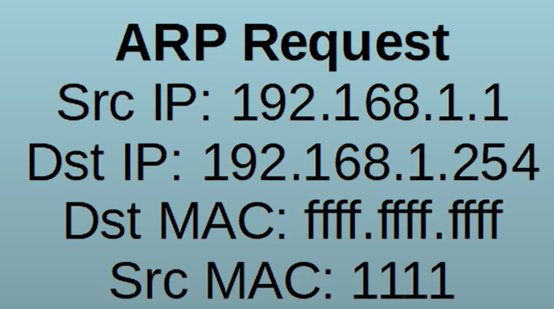
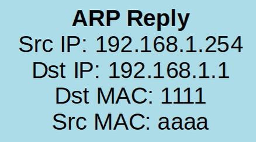
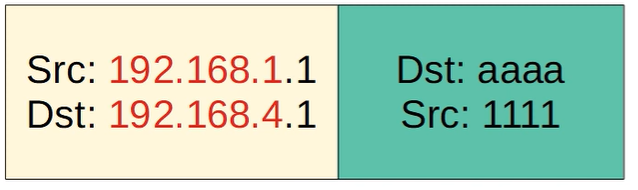
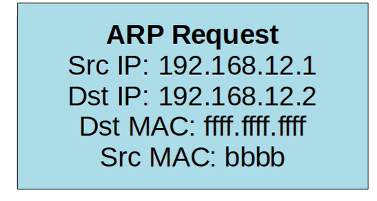

# Life of a Packet

Follow a packet from PC1 to PC4



src: 192.168.1.1
dst: 192.168.4.1

Because the dst is not in the same network as pc1, it knows it is in a different network and needs to send it to its default gateway. It first sends an ARP request


Switch 1 gets the frame, which sends it to all other interfaces, so gets sent to R1. R1 notices that the destination ip is its own ip, so creates an ARP reply frame



The ARP request message was broadcast, but the arp reply is unicast. PC1 now knows the MAC address of it's default gateway. It encapsulaes the packet with this ethernet header. Only at layer 2 is the destination set to the R1 mac address.



It removes the ethernet header and looks at its routing table for the next hop ip. It sends a ARP request message 



It encapsulate the packet with an ethernet header with R2's mac address in the destination field. R2 removes the ethernet header and looks in its routing table, sends an ARP request to R4, which replies with its mac address. R3 adds the ethernet header with R4's mac address in the destination field and sends the frame.

R4 receives the frame, removes the ethernet header and looks in its routing table and sees the network is directly connected. It broadcasts an ARP request to get the mac address of PC4, which then PC4 does a unicast reply with its mac address. R4 adds the ethernet header with PC4's mac address and sends the frame.

PC4 receives the frame and processes the frame up the OSI stack.

On the way back, the route is already known so there is no need to send ARP requests to learn mac addresses.

## Packet tracer

you can get the mac address of a router interface by running:

```
enable
show interfaces g0/0
```