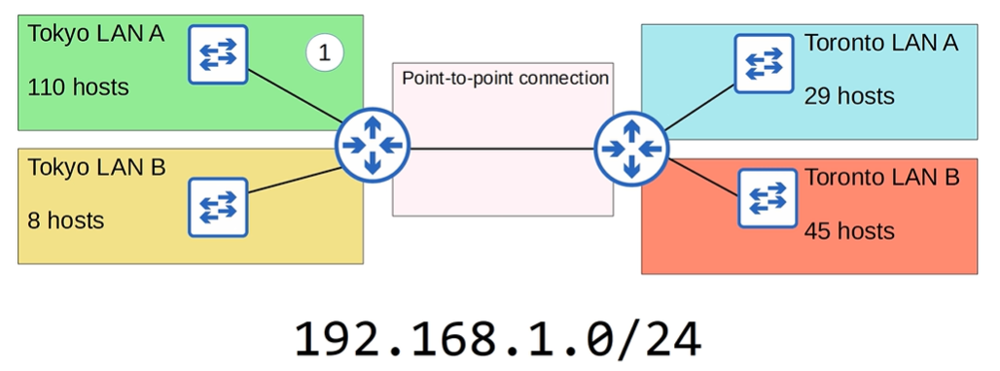

# Subnetting

## IPv4 Address classes
```
Class   Prefix Length   First Octet Numeric Range
A       /8              0-127
B       /16             128-191
C       /24             192-223
```

## IANA

* The IANA (internet assigned numbers authority) assigns IPv4 addresses/networks to companies based on their size
* A very large company would receive class A or B network, while a small company would receive class C.
* This system led to wasted IP addresses

* A point to point network (between routers) would be assigned 256 addresses, but only need four.

## CIDR - Classess Inter-Domain Routing

* With CIDR, the requirements for class A being /8, B /16 and C /24 were removed, allowing large networks to be split into smaller ones allowing greater efficiency. The smaller networks are called subnetworks/subnets.

Number of usable addresses:
```
2^n - 2 = useable addresses
where n is the number of host bits
```
For example, /25:
```
11001011.00000000.01110001.00000000
203     .0       .113     .0
11111111.11111111.11111111.10000000 (/25)
255     .255     .255     .128
There are 7 host bits, so 2^7 - 2 = 126 useable addresses
```

## /31 - Point to point networks

for the network `203.0.133.0/31`, there is the ip range `203.0.113.0` to `203.0.113.1` (two addresses). In binary:
```
11001011.00000000.011110001.00000000
11001011.00000000.011110001.00000001
```
In a point to point network, there is no need for a network address or broadcast address, so the only two addresses could be assigned to the two interfaces on the routers.


## /32

The entire address is the network, there are 0 host bits and there is -1 useable addresses. They can be used for networks to specific hosts.

## CIDR Notation


## Examples
### Example 1


* We need 47 addresses per subnet
* 47 * 4 = 118  addresses needed.
* 192.168.1.0/24 is a class C network, which can accomodate up to 256 addresses.
* We need four equal size subnets, with enough room for 45 hosts
```
/30 -> 2 host bits -> 2^2-2 = 2 useable addresses
/29 -> 3 host bits -> 2^3-2 = 6 useable addresses
/28 -> 4 host bits -> 2^4-2 = 14 useable addresses
/27 -> 5 host bits -> 2^5-2 = 30 useable addresses
/26 -> 6 host bits -> 2^6-2 = 62 useable addresses
```

Subnet 1 is `192.168.1.0/26`, to find the next subnet we get the broadcast address of S1 and find the next address from that.

```
11000000.10101000.00000001.00000000 - Address
11111111.11111111.11111111.11000000 - Net mask
11000000.10101000.00000001.00111111 - Broadcast
11000000.10101000.00000001.01000000 - Next address
192     .168     .1       .64
```
So subnet 2 is `192.168.1.64/26`. Similarly, the next useable address after that is:
```
11000000.10101000.00000001.10000000
192     .168     .1       .128

then...
11000000.10101000.00000001.11000000
192     .168     .1       .192
```

So the four subnets are:
```
192.168.1.0/26
192.168.1.64/26
192.168.1.128/26
192.168.1.192/26
```

### Example 2

What subnet does host 192.168.5.57/27 belong to?

```
192     .168     .5       .57
11000000.10101000.00000101.00111001
11111111.11111111.11111111.11100000 - Net mask
11000000.10101000.00000101.00100000
192     .168     .5       .32
```

### Example 3

What subnet does host 192.168.29.219/29 belong to?

```
192     .168     .29      .219      /29
11000000.10101000.00011101.11011011
11111111.11111111.11111111.11111000
11000000.10101000.00011101.11011000
192     .168     .29      .216      /29
```

## Subnets/Hosts (Class C)


## VLSM - Variable length subnet masks

* Until now we have used FLSM (fixed length subnet masks)
* This means all the subnets use the same prefix length (i.e. class C network into four subnets using /26)
* VLSM is the process of creating subnets of different sizes for more efficient network address usage

Steps:
1. Assign the largest subnet at the start of the address space
2. Then sign the second largest after it
3. Repeat until all subnets have been assigned



1. Tokyo LAN A
2. Toronto LAN B
3. Toronto LAN A
4. Tokyo LAN B

For Tokyo LAN A, use a /25 net mask as it leaves 128 addresses, or 126 useable addresses.

```
Network Address:
192.168.1.0/25
Broadcast Address:
192.168.1.127
First useable address:
192.168.1.1
Last useable address:
192.168.1.126
Total number of useable host address:
126
```

For Toronto LAN B, the next useable address is 192.168.1.128, it needs 45 hosts so a /26 net mask will give 64 addresses, or 62 useable host addresses.

```
Network address:
192.168.1.128/26
Broadcast address:
192.168.1.191/26
First useable address:
192.168.1.129/26
Last useable address:
192.168.1.190/26
Total number of useable host addresses:
62
```

For Toronto LAN A, need 29 hosts so a /27 net mask will give 32 addresses, 30 useable hosts
```
Network address:
192.168.1.192/27
Broadcast address:
192.168.1.223/27
First useable address:
192.168.1.193/27
Last useable address:
192.168.1.222/27
Total number of useable host addresses:
30
```

For Tokyo LAN B, need 8 hosts, /28 net mask will give 16 addresses, 14 useable. (/29 would give 8 addresses, 6 useable so too few).

```
Network address:
192.168.1.225/28
Broadcast address:
192.168.1.239/28
First useable address:
192.168.1.226/28
Last useable address:
192.168.1.238/28
Number useable host addresses:
14
```

For the point to point connection we need two addresses. The network address is 192.168.1.240, we should use a /30 subnet mask giving 4 addresses with 2 useable hosts.
```
Network address:
192.168.1.240/30
Broadcast address:
11110011
192.168.1.243/30
First useable address:
192.168.1.241/30
Last useable address:
192.168.1.242/30
Number of useable addresses:
2
```