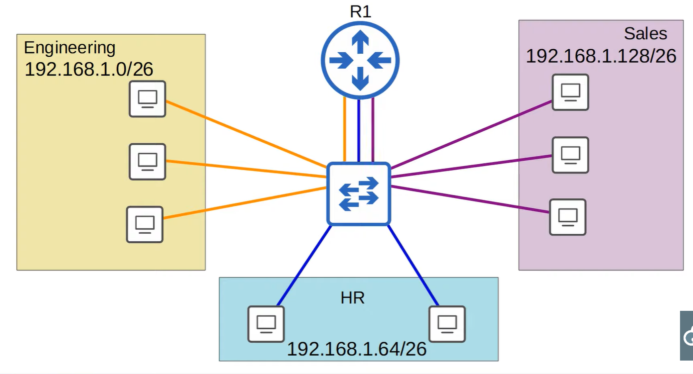
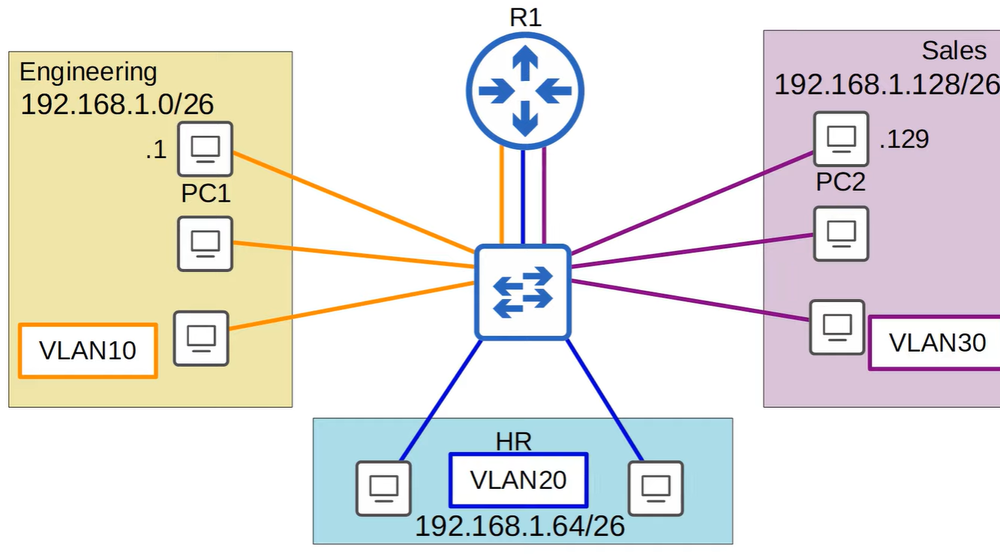
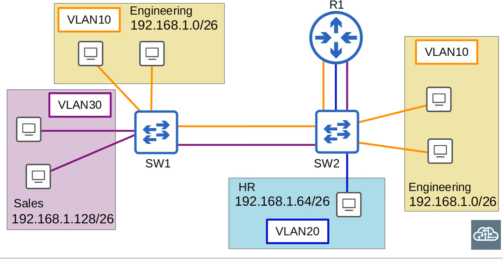
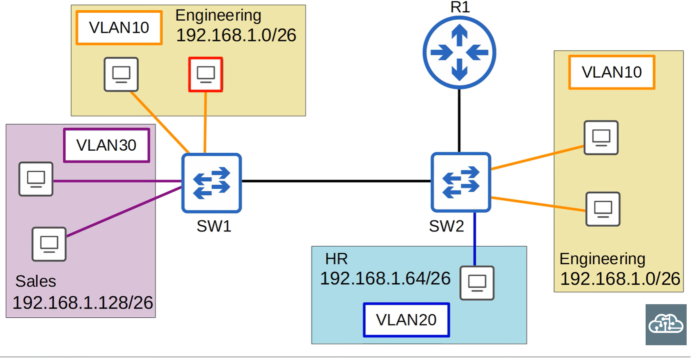
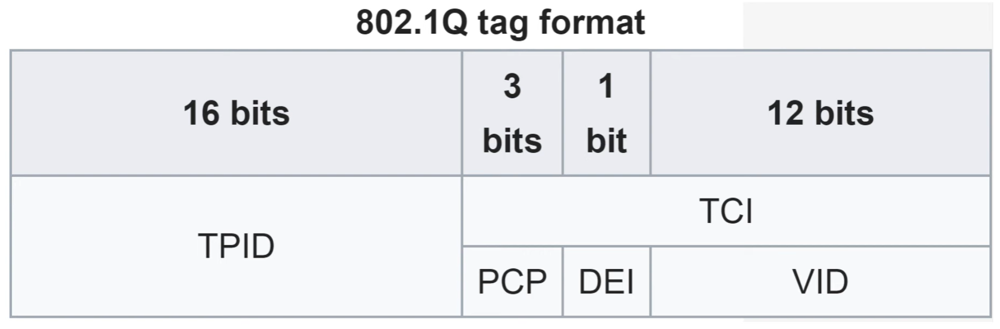
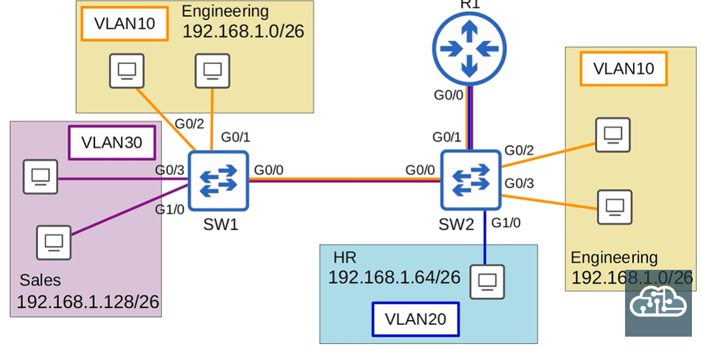
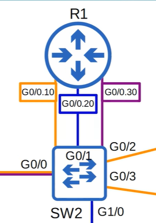
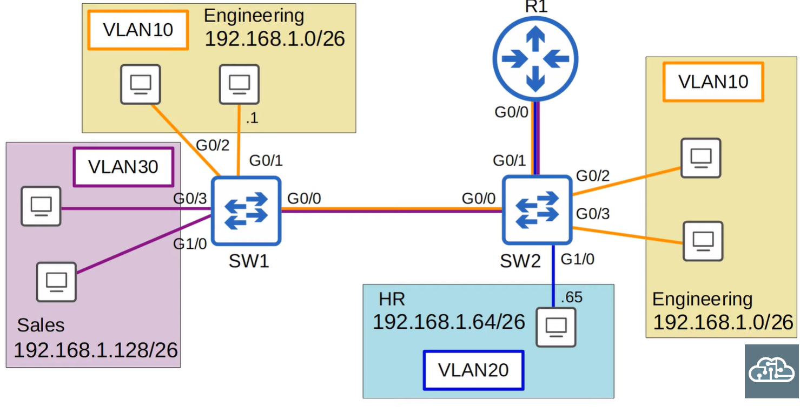
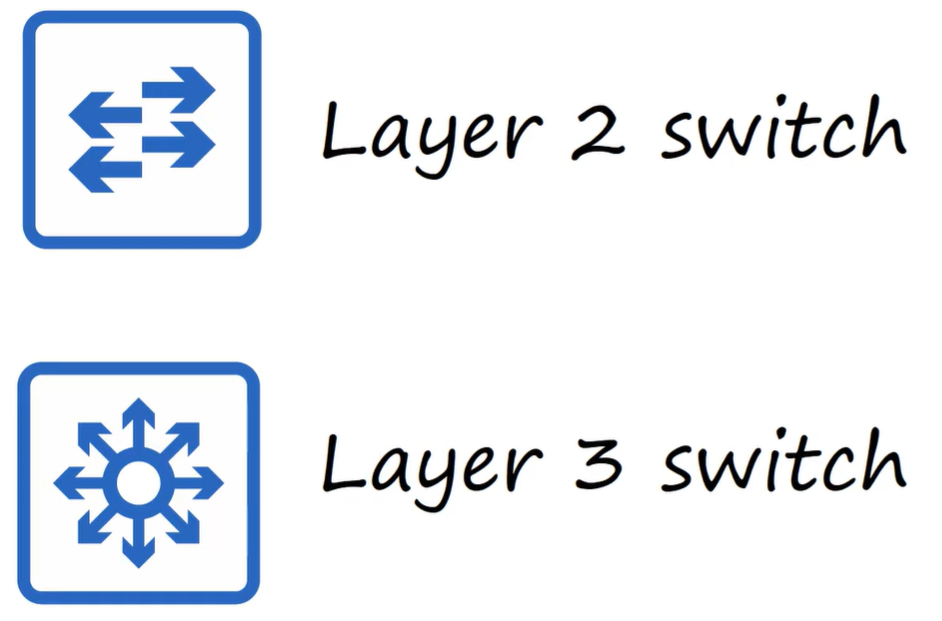
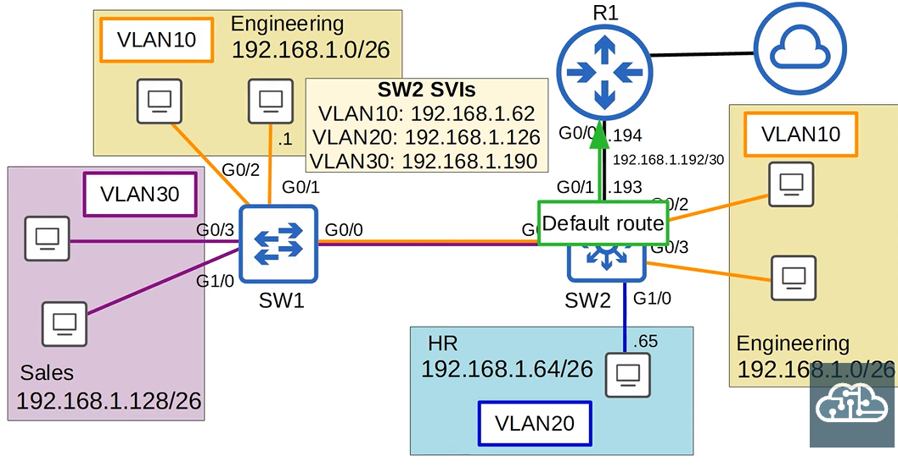

# VLAN - Virutal Local Area Network

* A LAN is a single broadcast domain, including all devices in that broadcast domain
* A broadcast domain is the group of devices which will receive a broadcast frame (destination MAC address of FFFF.FFFF.FFFF)
* Lots of broadcast traffic can reduce network performance



To make three VLANS, the router needs an IP for each subnet, so has three connections to the switch. However, a broadcast frame sent to the switch will still be sent to the other subnets.



You can assign switch interfaces to a VLAN, and the switch will not forward to other VLANs.

## Commands

```
show vlan brief
interface range g1/0 - 3
switchport mode access
switchport access vlan 10

vlan 10
name ENGINEERING
```



VLAN20 can reach other VLANS via inter-VLAN routing via R1.

## Trunk ports

In a small network with few VLANs it is possible to use a separate interface for each VLAN when connecting switches to switches and switches to routers.

However, when the number of VLANs increases, this is not always viable. It will result in wasted interfaces and often routers wont have enough interfaces for each VLAN.

You can use trunk ports to carry traffic from multiple VLANs over a single interface.



Switches will tag all frames that they send over a trunk port, this allows the receving switch to know which VLAN the frame belongs to. Trunk ports are also known as tagged ports, and access ports known as untagged ports.

There are two main trunking protocols: ISL and IEEE 802.1Q.

ISL is an old Cisco protocol, IEEE 802.1Q is an industry standard protocol.


* The 802.1Q tag is inserted between the source and type/length fields of the ethernet frame
* The tag is 4 bytes (32 bits) in length
* The tag consists of two main fields:
    * Tag Protocol Identifier (TPID)
    * Tag Control Information (TCI)
* The TCI consists of three sub fields



### TPID - Tag Protocol Identifier

* 16 buts in length
* Always set to a value to x8100. Indicates that the frame is 802.1Q tagged.

### PCP - Priority Code Point

* 3 bits in length
* Used for class of service (CoS) which prioritizes important traffic in congested networks

### DEI - Drop Eligible Indicator

* 1 bit in length
* Used to indicate frames that can be dropped if the network is congested

### VID - VLAN ID

* 12 bits in length
* Identifies the VLAN the frame belongs to
* 12 bits in length = 4096 total VLANS
* VLANS 0 and 4095 are reserved and cant be used
* Therefore the range is 1 - 4094
* Cisco's propriatory ISL also has a range of 1 - 4094

## VLAN Ranges

* The range of VLANS is 1-4094
    * Normal VLANS: 1 - 1005
    * Extended VLANS: 1006 - 4094
* Some older devices cannot use the extended VLAN range

If a PC in the second VLAN10 subnet wants to send a message to a PC in the first VLAN10 subnet, it first sends a frame to SW2, which adds the VLAN10 tag and sends the frame to SW1, which will forward the traffic to the destination.

## Native VLAN

* 802.1Q has a feature called native VLAN
* Native VLAN is VLAN 1 on all trunk ports by default, but can be configured
* The switch does not add a 801.1Q tag to frames in the native VLAN
* When a switch receives an untagged frame on the trunk port, it assumes the frame belongs to the native VLAN
* Important that the native VLAN matches between switches

## Trunk Configuration



```
interface g0/0
switchport trunk encapsulation dot1q
switchport mode trunk
show interfaces trunk
switchport trunk allowed vlan 10,30
switchport trunk allowed vlan add 20
switchport trunk allowed vlan remove 20
switchport trunk allowed vlan all
switchport trunk allowed vlan except 1-5,10
switchport trunk allowed vlan none
switchport trunk native vlan 1001
show interfaces trunk
```

Switch 1 config:
```
switchport trunk allowed vlan 10,30
switchport trunk native vlan 1001
```
Switch 2 config:
```
interface g0/0
switchport trunk encapsulation dot1q
switchport mode trunk
switchport trunk allowed vlan 10,30
switchport trunk native vlan 1001

interface g0/1
switchport trunk encapsulation dot1q
switchport mode trunk
switchport trunk allowed vlan 10,20,30
switchport trunk native vlan 1001
```

## ROAS - Router on a Stick

* ROAS is used to route between multiple VLANS using a single interface on the router and switch
* The switch interface is configured as a regular trunk
* The router interface is configured using subinterfaces. You configure the VLAN tag and IP address on each subinterface.
* The router will behave as if frames arriving with a certain VLAN tag have arrived on the subinterface configured with that VLAN tag
* The router will tag frames sent outo f each subinterface with the VLAN tag configured on the subinterface



R1 Config:
```
interface g0/0
no shutdown
interface g0/0.10
encapsulation dot1q 10
ip address 192.168.1.62 255.255.255.192
interface g0/0.20
encapsulation dot1q 20
ip address 192.168.1.126 255.255.255.192
interface g0/0.30
encapsulation dot1q 30
ip address 192.168.1.190 255.255.255.192

show ip interface brief
show ip route
```

## ROAS - Native VLAN on a router



Option 1:
```
interface g0/0.10
encapsulation dot1q 10 native
```

Option 2:
Configure the IP address for the native VLAN on the routers physical interface

```
interface g0/0
ip address 192.168.1.62 255.255.255.192
```

## Layer 3 (Multilayer Switch)



* Capable of both switching and routing
* It is layer 3 aware (ip addresses)
* You can assign IP addresses to its interfaces, like a router
* You can create virtual interfaces for each VLAN and assign IP addresses to those interfaces
* You can configure routes on it, like a router
* It can be used for inter-VLAN routing

## Inter-VLAN Routing via SVI (Switch Virtual Interfaces)

* SVIs are the virtual interfaces you can assign IP addresses to in a multilayer switch
* Configure each PC to use the SVI (not the router) as the default gateway
* To send traffic to different subnets/VLANs, the PC will send traffic to the switch and the switch will route the traffic.



R1 config
```
default interface g0/0
interface g0/0
ip address 192.168.1.194 255.255.255.252
```

SW2 config
```
default interface g0/1
ip routing  # Enables layer 3 routing on the switch
interface g0/1
no switchport # Configures the interface as a routed port (L3 port, not L2)
ip address 192.168.1.193 255.255.255.252
do show ip interface brief

exit
ip route 0.0.0.0 192.168.1.194
do show ip route
do show interfaces status

interface vlan10
ip address 192.168.1.62 255.255.255.192
no shutdown
interface vlan20
ip address 192.168.1.126 255.255.255.192
no shutdown
interface vlan30
ip address 192.168.1.190 255.255.255.192
no shutdown
```