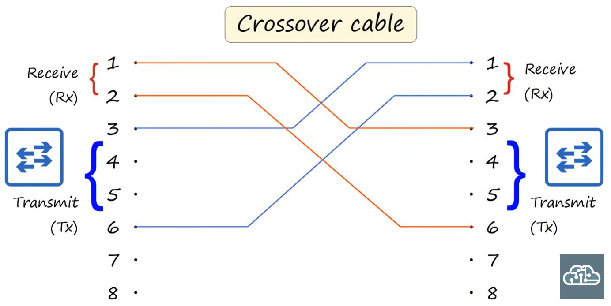
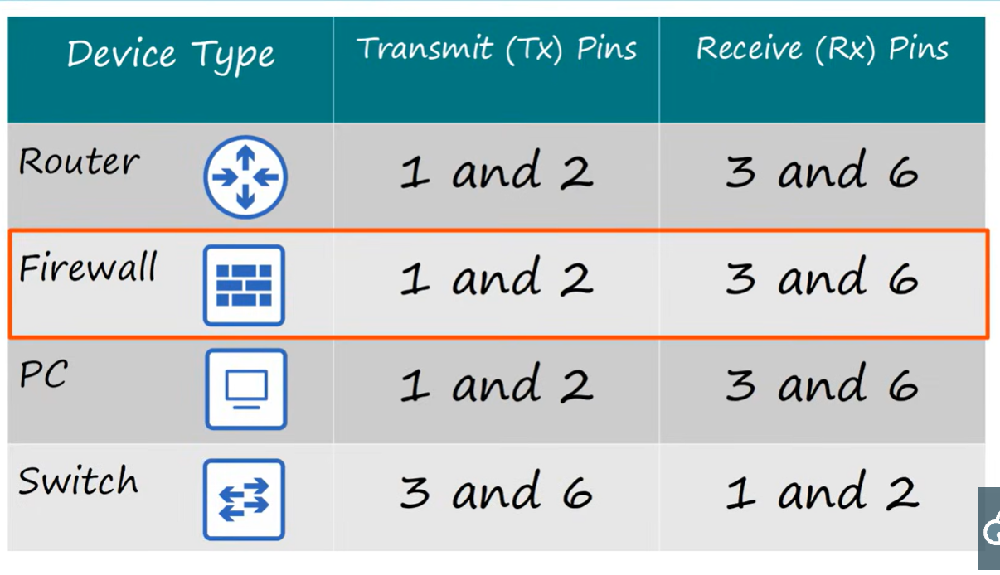
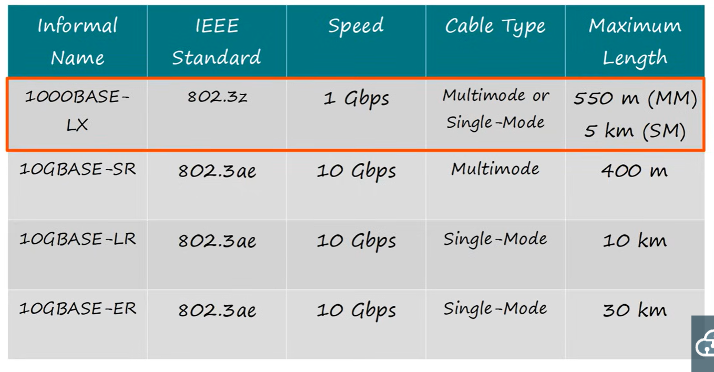
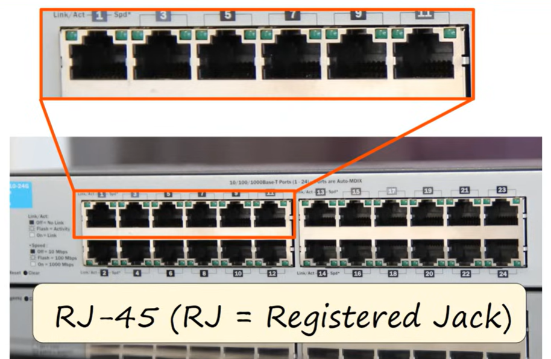

# Interfaces and Cables

# Bits and Bytes

1 kilobit (Kb) = 1000 bits
1 megabit (Mb) = 1,000,000 bits
1 gigabit (Gb) = 1,000,000,00 bits
1 terabit (Tb) = 1,000,000,00,000 bits

## Ethernet

Ethernet is a collection of network protocols/standards

### Ethernet standards

* Defined in the IEEE 802.3 standard in 1983
* 10 Mbps -> Ethernet
* 100 Mbps -> Fast ethernet
* 1 Gbps -> Gigabit Ethernet
* 10 Gbps -> 10 Gig Ethernet

Also known as 10BASE-T, 100BASE-T, 1000BAST-T, 10GBASE-T where BASE refers to baseband signaling and T is twisted pair cabling.

The maximum cable length for ethernet is 100m.

## UTP Cables

Unshielded twisted pair. The twisted pair protects against electromagnetic interferance. There are 8 pins in a UTP cable. 10/100BASE-T cables use two pairs (4 wires). 1000BASE-T and 10GBASE-T use 4 pairs (8 wires).

### PC To Switch

The PC uses pins 1 and 2 to transmit data (TX). The switch uses pins 1 and 2 to receive data (RX).

The next two pins used are 3 and 6 and the roles are reversed. For the switch, 3 and 6 are used for transmitting (TX) and for the PC they are used for receiving (RX). This is known as full-duplex transmission, allowing both devices to send and receive data at the same time.

### Router to switch

A router transmits on pins 1 and 2, and recieves on 3 and 6, being the inverse of the switch. Again, with full duplex transmission.

### Straight through vs Crossover cable

When pin 1 connects to pin 1, pint 2 to pin 2 etc it is called a straight through cable. When you want to connect two PCs, two switches or two routers to eachother, you need a crossover cable.

A crossover cable connects 1 and 2 to 3 and 6, and visa versa.

### Auto MDI-X

Modern networks automatically detect which pins their neighbour is transmitting data on and automatically adjust which pins to use.

### Higherspeed cables (1000BASE-T and 10GBASE-T)

The other pairs are 4/5 and 7/8. Additionally, each pin is bi-directional.

## Fiber-Optic Connections

Two cables on each end, one for Tx and one for Rx.

### Single-mode

* The core diameter is narrower than multimode fiber
* Light angles at a single angle (mode) from a laser-based transmitter
* Allows longer cables than UTP and multimode
* More expensive than multimode due to more expensive laser based SFP transmitter

### Multimode

* The core diameter is wider than single-mode fiber
* Allows multiple angles of light waves to enter the fiberglass
* Allows longer cables than UTP but still shorter than single mode fiber
* Cheaper than single mode fiber (due to cheaper LED-based SFP transmitters)

## RJ-45

Used at the end of a copper ethernet cable
