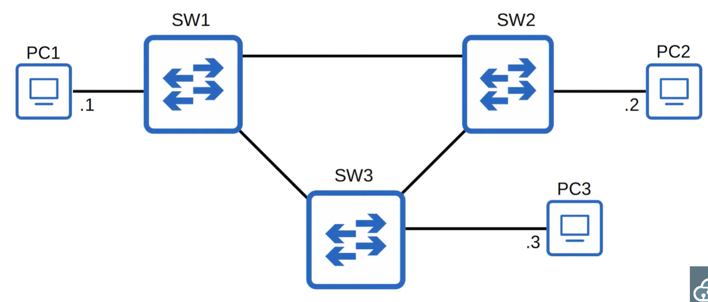

# Spanning Tree Protocol

## Network Redundancy

* Essential part of network design
* Modern networks are expected to run 24/7/365.
* If one network component fails, other components will take over without downtime
* Implement redundancy at every possible point

## Broadcast Storms



The ethernet header doesnt have a TTL field, so the broadcast frames will loop around the network indefinitely. If enough of the looped broadcasts accumulate, the network will become too congested for legitimite traffic.

Each time the frame arrives on a switchport, the switch uses the source MAC address field to learn the mac address and update the mac address table. When frames with the same source MAC address is repeatedly arrive on different interfaces, the switch is continuously updating the interface in its MAC address table. This is known as MAC address flapping.

## STP

* Classic STP is IEE 802.1D
* Switching from all vendors run STP by default
* STP prevents layer 2 loops by placing redundant ports in a blocking state, disabling the interface
* These interfaces act as backups that can enter a forwarding state if an active interface fails
* Interfaces in a forwarding state behave normally. They send an receive all normal traffic.
* Interfaces in a blocking state only send or receive STP messages (BDUs, Bridge Protocol Data Units).
* By selecting which ports are forwarding/blocking, STP creates a single path to/from each point in the network, preventing layer 2 loops
* There is a set process that STP uses to determine which ports should be forwarding/blocking
* STP enabled switches send/receive hello BPDUs out of all interfaces, the default timer is 2 seconds.
* If a switch receives a hello BPDU on an interface, it knows that interface is connected to another switch (routers/pcs do not use STP, so they do not send BPDUs)
* Switches use one field in the STP BUDU, th bridge ID to elect the root bridge for the network
* The switch with the lowest bridge id becomes the root bridge
* All ports on the root bridge are designated ports and put in a forwarding state, other switches in the topology must have a path to reach the root bridge


* When a switch is powered on it assumes it is the root bridge
* It will only give up its position if it receives a superior BPDU
* Once the topology has converged and all switches agree on the root bridge, only the root bridge sends BPDUs
* Other switches in the network will forward these BPDUs but not generate their own
* Each remaining switch will select one of its interfaces to be its root port, the interface with the lowest *root cost* will be the root port. Root ports are also in a forwarding state


* The root cost is the total cost of the outgoing interfaces to the path to the root bridge
* The root cost on the root bridge interfaces is 0

* Switch 2 receives the BPDU and adds its cost
    * The cost on G0/1 is 0 from root 1 and 4 from it's interface for a total of 4
    * The cost on G0/0 is 4 from the interface on SW3 and 4 from it's own interface, for a total of 8
    * Therefore it will choose G0/1 as its root port
* If there is a tie in root cost, it will choose the one with the lowest bridge ID
* If the root cost and neighbor bridge id is the same, it will choose he root port as the port with the lowest neighbor port ID


* In the example below, port G0/2 on switch 3 is the designated port as G0/1 is has the lowest port ID on switch 3's neigbor, switch 2.


* Every collision domain has a single STP designated port
    * The switch with the lowest root cost will make its port designated
    * If the root cost is the same, the switch with the lowest bridge ID will make its port designated
    * The other switch will make its port non-designated (blocking)


## STP States


### Blocking State

* Non designated ports are in a blocking state
* Interfaces in a blocking state are disabled to prevent loops
* Interfaces in a blocking state do not send/receive network traffic other than STP BPDUs
* However they do not forward STP BPDUs
* Interfaces in a blocking state do not learn MAC addresses

### Listening State

* Interfaces in a designated or root ports are in a listening state
* The listening state is 15 seconds long by default, determined by the forward delay timer
* An interface in the listening state only forward STP BPDUs, it does not forward network traffic
* It does not learn MAC addresses

### Learing state

* The learning state is 15 seconds long, determined by the forward delay timer (same for listening and learning state)
* An interface in the learning state only sends/receives STP BPDUs
* Does not send/receive regular traffic
* Does learn MAC ddresses from regular traffic

### Forwarding state
* Root and desginated ports are in a forwarding state
* Operate as normal
* Sends/receives BPDUs
* Sends/receives normal traffic
* Learns MAC addresses


## Spanning Tree Timers


### Hello
* Hello BPDUs only get sent acrossed designated ports

### Max Age
* If a BPDU is received before the max age timer counts to 0, the time will reset to 20 seconds and no changes occur
* If another BPDU is not received, the max age timer counts down to 0 and the switch will reevaluate its STP choices, including root bridge, local root, designated and non designated ports.
* If a non desgnated port is selected to become a desginated or root port, it will transition from the blocking state to the listening state (15 seconds), learning state (15 seconds) then the forwarding state. It can take a total of 50 seconds for a blocking interface to transition to forwarding.
* The timers are used to make sure loops arent accidentally created by an interface moving to a forwarding state too soon

## Spanning Tree Bridge Protocol Data Unit


In the ethernet header section, Cisco's PVST+ uses the destination MAC address of:
```
01:00:0c:cc:cc:cd
```
Regular STP uses:
```
0180.c200.0000
```

## Portfast


* Ports connected to PCs must cycle through listening and learning before sending data
* Portfast allows a port to move immediately to a forwarding state, bypassing listening and learning
* If used, it must be enabled only on ports connected to end hosts
* If enabled on a port connected to another switch it could cause a layer 2 loop

```
interface g0/2
spanning-tree portfast
```

## BPDU guard

* If an interface with BPDU guard enabled receives a BPDU from another switch, the interface will be shutdown to prevent a loop from forming
```
interface g0/2
spanning-tree bpduguard enable
```
or from global config mode
```
spanning-tree portfast bpduguard default
```
Which enables BPDU guard on all portfast enabled interfaces

To enable a port that was disabled by BPDU guard:
```
shutdown
no shutdown
```
on the interface

### Configuration

```
# sets the STP mode, pvst is classic and rapdi-pvst is default
spanning-tree mode (mst/pvst/rapid-pvst)
# makes the id 4096 less than the current roots id
spanning-tree vlan 1 root primary
# makes the switch be second in line, if the root fails
spanning-tree vlan 1 root secondary
do show spanning-tree

## STP Port settings ##
spanning-tree vlan 1 cost 0-200000000
spanning-tree vlan 1 port-priority 0-244
```
l
## STP Load-Balancing

VLAN1 Topology

VLAN 2 Toplogy


* If you have multiple VLANS, blocking the same interface in each vlan is a waste of bandwidth as that interface will be doing nothing
* If you configure a differen root bridge for different VLANs, different VLANS will disable different interfaces
