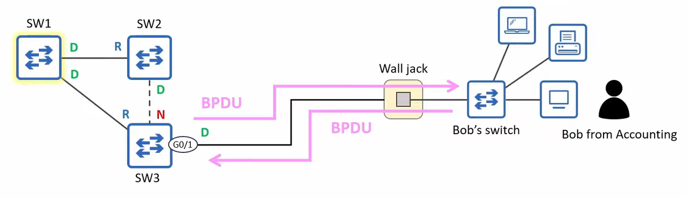
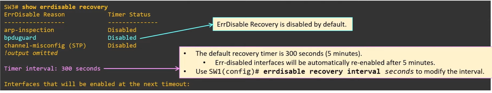

# BPDU Guard & Filter

* PortFast makes a port start in the forwarding state when its connecting, but doesnt disable STP on the port
    * The port will continue to send BPDUs every 2 seconds
* Because end hosts dont run STP and send BPDUs, a PortFast enabled port shouldnt recieve BPDUs
    * but what if it does?

## BPDU Guard



* What is bob's switch became the root bridge?
* PortFast should only be enabled on ports connected to non switch devices
* However, will still continue to send BPDUs
* If an end user connected a switch, it will effect the network topology
* BPDU guard safeguards against this, protecting the network from unauthorized switches being connected to ports inteded for end hsots
* Can be configured separately from PortFast, but usually used together
* A BPDU guard enabled port continues to send BPDUs but if it receives a BPDU, it enters the error-disabled state
    * It disables the port, both sending and receiving BPDUs (and network traffic)
* It can be configured in two ways:
    * per port:
    ```
    interface g0/1
    spanning-tree bpduguard enable
    ```
    * default:
    ```
    spanning-tree portfast bpduguard default
    ```
and disable:
```
spanning-tree bpduguard disable
```

## ErrDisable

* Indicated by a solid yellow light on the port, which does not turn off when you unplug the ethernet cable
* To fix the port, you should first solve the underlying issue otherwise it will just become err-disabled again
* Two ways to re-enable:
    * `shutdown` and `no shutdown` to reset the disabled port
    * ErrDisable recovery

## ErrDisable Recovery

* Automatically re-enables err-disabled ports after a certain period of time

* `errdisable recovery cause` to enable for a particular cause, i.e.
```
errdisable recovery cause bpduguard
```

## BPDU Filter

* A switchport connected to an end host continues sending BPDUs every 2 seconds, regardless of if PortFast/BPDU guard are enabled
* If the port doesnt connect to a switch, sending BPDUs is unnecessary and undesirable because:
    * Sending BPDUs uses some bandwith/processing (although its minimal)
    * Includes some information about the LANs STP topology
        * If maximum security is a concern, it should not be sent to user devices
* A BPDU filter stops a port from sending BPDUs
    * Unlike a BPDU guard, it does not disable the port if it receives a BPDU
* Can be enabled in two ways:
    * Per port:
    ```
    spanning-tree bpdufilter enable
    ```
    * The port will not send BPDUs, and will ignore BPDUs it receives
    * This disables STP on the port **use with caution** (can cause perminant layer 2 loops)
    * Default:
    ```
    spanning-tree portfast [edge] bpdufilter default
    ```
    * Activated on all portfast enabled ports
    * Can use `spanning-tree bpdufilter disable` to disable it on specific ports
    * The port will not send BPDUs
    * If the port receives a BPDU, PortFast and BPDU filter are disabled and it operates a normal STP port

## Summary
* Enable Portfast and BPDU guard however you prefer (per port or default)
* Only enable BPDU filter by default
* BPDU guard and filter can be enabled on the same port at the same time
* If BPDU filter is enabled in global config mode and the port receives a BPDU:
    * The BPDU filter will be disabled
    * The BPDU guard will be triggerd and err-disable the interface
* If BPDU filter is enabled in interface config mode and the port recieves a BPDU:
    * The BPDU filter will be ignord
    * the BPDU guard will not be triggered
* PortFast should only be enabled on ports connected to non-switch devices that dont send BPDUs
    * It will stil send BPDUs and operate like a regular STP port if it receives BPDUs from a neighbour
    * If an end user connects a switch to a port meant for end hosts, it could affect the STP topology
