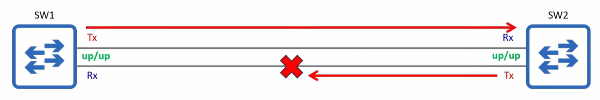
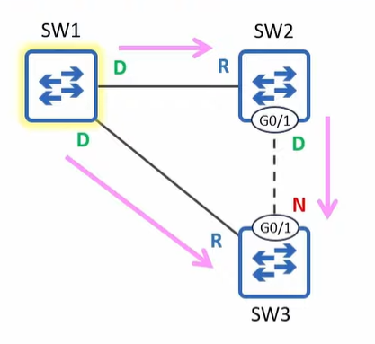
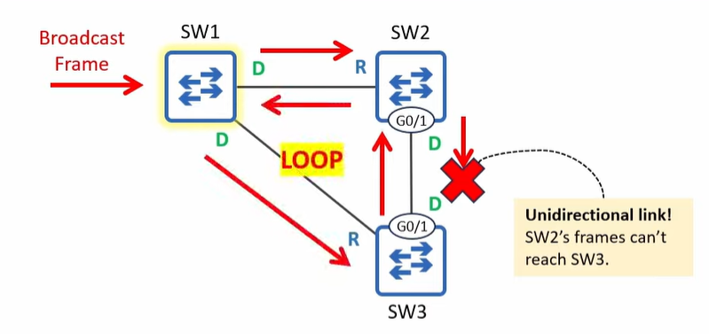

# Loop Guard

* Protects the network from loops by disabling a port if it unexpectedly stops receiving BPDUs, ensuring it does not mistakenly enter the forwarding state


## Unidirectional links

* A network link where data transmission only occurs in one direction
* Typically caused by a layer 1 (physical) issue
    * damaged cables
    * Faulty connectors
* more common with fiber-optic cables than copper UTP
    * FO uses two separate fibers
    * If one fiber is damaged, it distrupts data flow in one direction
    * more vulnerable to physical damage than copper cables
* If there is a problem with either fiber, the devices *should* be able to detect it and disable their interfaces
* If the devices fail to detect the physical problem, it could result in a unidirectional link


## The problem

* BPDUs originate from the root bridge and are forwarded out of designated ports every 2 seconds
* SW3 G0/1 is a non designated blocking port because it receives superior BPDUs from SW2
* If SW2-SW3 link becomes unidirectional, and SW2's BPDUs cant reach SW3, what happens?
    * SW3 assumes no more loop in the LAN
    * SW3 G0/1 becomes a designated port and starts forwarding BPDUs
    * SW2 G0/1 and SW3 G0/1 are both in the forwarding state
    * Creating a loop with SW1/3/2

* When a loop guard enabled port's max age timer counts down to 0, it doesnt become a designated port and start forwarding
    * it enters the broken state
    * Like the broken state triggerd by root guard, it blocks the port
* If the broken port starts receiving BPDUs again, it will automatically become re-enabled
* Can be enabled:
    * per port:
    ```
    spanning-tree guard loop
    ```
    * default:
    ```
    spanning-tree loopguard default
    ```
    * to disable on specific ports:
    ```
    spanning-tree guard none
    ```
* Should be enabled on root and non designated ports
* Loop guard and root guard are mutually excusive, they cannot be used on the same port at the same time
    * Root guard prevents designated ports becoming root ports
    * Loop guard prevents non-designated/root ports becoming designated ports
