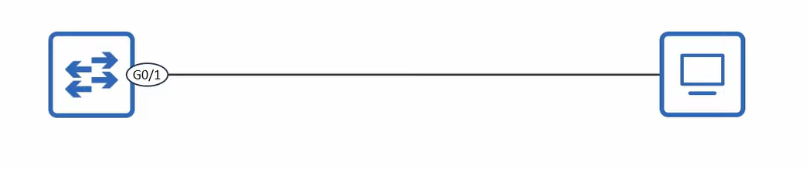
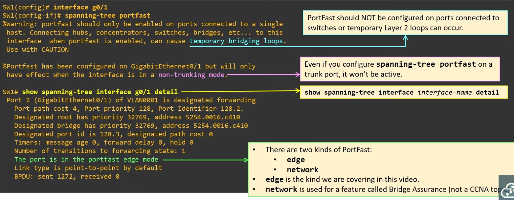
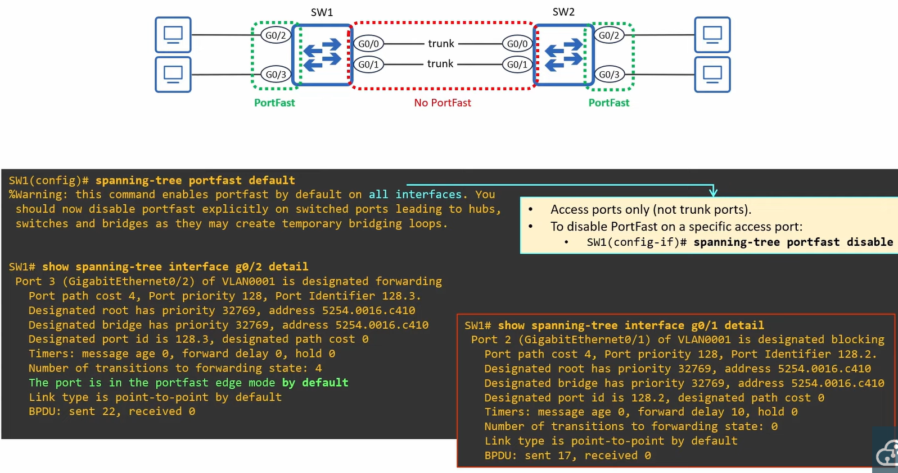
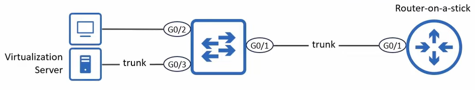

# STP Toolkit - Portfast



* When an end host connects to a switch port, the port becomes up/up but cant send/receive data yet
* It is an STP designated port, but will take 30 seconds before entering the forwarding state
* When portfast is configured on a port it immediately enters the forwarding state, it bypasses listening/learning and can forward data straight away
* You can configure portfast in two ways:
    * `spanning-tree portfast` (on port interface)
    * `spanning-tree portfast default` enables portfast on all access ports. Connections between switches are almost always trunk links, but to hosts they are access links.

## Configuration

### Interface


### default



## PortFast on Trunk ports

* The standard portfast config commands only enable on access ports
* In some cases, you might want to enable on a trunk port



* A port connected to a virtualization server with VMs in different VLANs
* A port connected to a router on router-on-a-stick (ROAS)
* This can only be configured per-port in interface config mode:
```
spanning-tree portfast trunk
```

## PortFast edge

* In modern cisco switches, the device automatically adds edge keyword to the Configuration
```
spanning-tree portfast -> spanning-tree portfast edge
spanning-tree portfast trunk -> spanning-tree portfast edge trunk
spanning-tree portfast default -> spanning-tree portfast edge default
```
