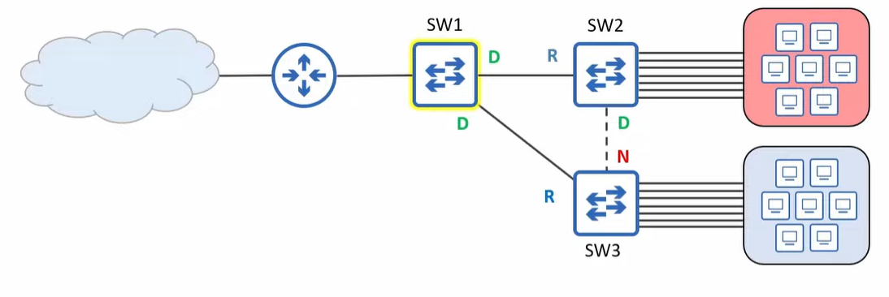
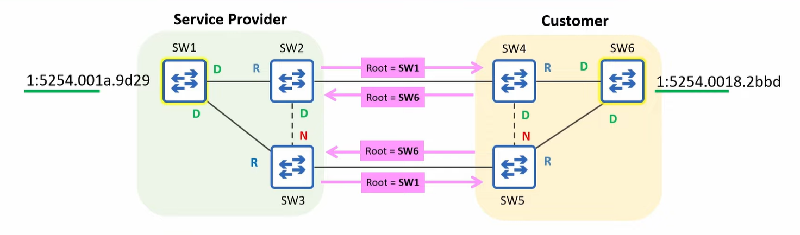

# Root Guard

* Prevents a port from becoming a root port by disabling it if superior BPDUs are received, thereby enforcing the current Root Bridge.
* Useful when connecting your LAN to another LAN, which you dont have control over.

* STP prevents loops by electinr a root bridge and ensuring each other switch only has one valid path to reach it
* You shouldnt randomly select the root bridge, you should consider:
    * optimial traffic flow (minimize latency/congestion)
    * stability and reliability (select a more reliable/modern switch as the root bridge)

## Root Guard: The Problem


* Within your own LAN, you can easily set the root bridge by setting its priority to 0
    * There are cases where you might connect your LAN to a swtich outside your direct control (i.e. a service provider offering metro ethernet service to customers, often used to connect sites within a Metropolitan Area Network)
* In the example above, switch 6 has the lower bridge ID and it will become the root bridge, with no safeguard in place
* Root guard can be configured to protect your STP topology by preventing your switches from accepting superior BPDUS from switches outside of your control.
* If you want to ensure that root bridge remains in your LAN, you can configure root guard on the ports connected to switches outside your control
    * SW2 G0/2, SW3 G0/2
* To enable on interface config mode:
```
spanning-tree guard root
```
* If a Root-Guard enabled port receives a BPDU, it will enter the Broken (root inconsistent) state, effectively disabling it.
    * The port will not be able to forward data frames and will discard any frames it receives.
* To re-enable a port disabled by root guard, you must solve the issue that disabled the port
    * The disabled port needs to stop receiveing superior BDPUs
    * The customer must increase the priority value of their swtich.
* Once the superior BPDUs received by SW2 G0/2 and SW3 G0/3 age out, the ports will be automatically re-enabled
    * A BPDUs max age is 20 seconds by default
* Then SW4/5/6 will accept SW1 as the root bridge
