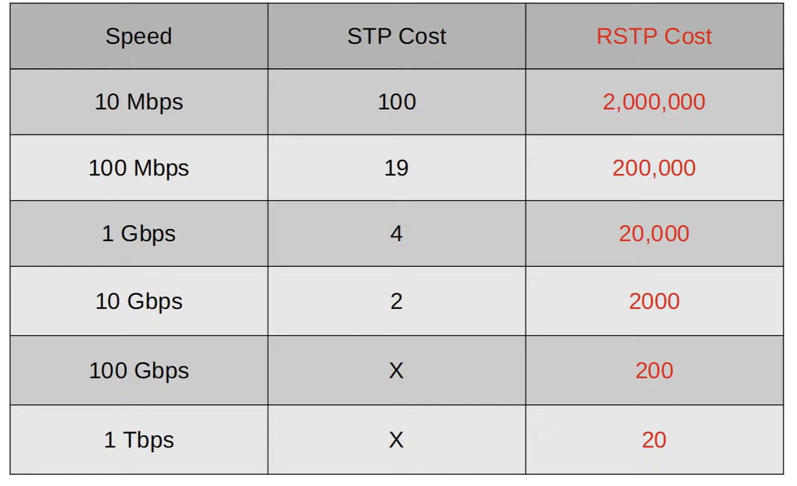
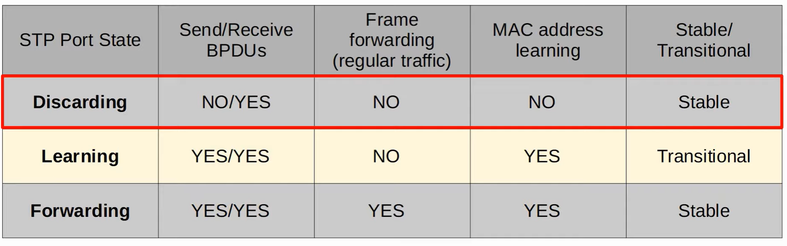
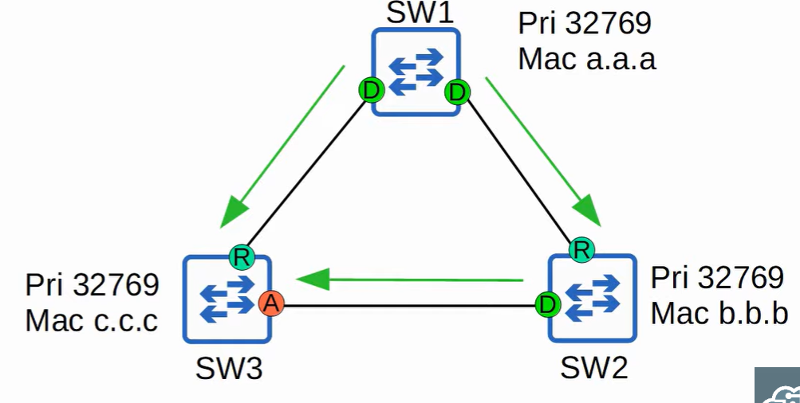
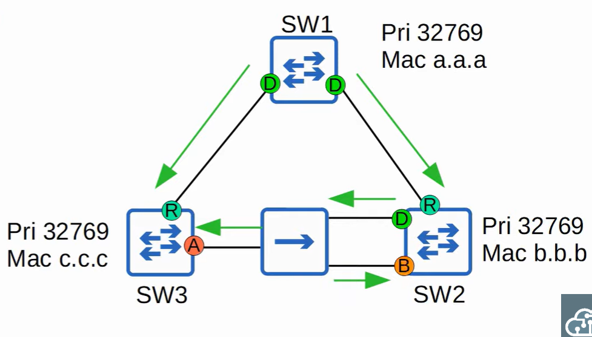

# Rapid (per VLAN) Spanning Tree (Rapid PVST+)

## Comparison of STP versions (Standard vs Cisco)

### Industry Standard IEEE (802.1D)
* Original STP
* All VLANS share one STP instance
* Therefore, no load balancing

### Per-VLAN Spanning Tree Plus (Cisco)
* Per VLAN spanning tree plus 
* Ciscos upgrade
* Each VLAN has its own STP instance
* Can load balance by blocking different ports in each VLAN

### Rapid Spanning Tree Protocol (IEEE 802.1w)
* Much faster at converging and adapting to network changes
* All VLANs share one STP instance
* Still cant load balance

### Rapid Per-VLAN Spanning Tree Plus, Rapid PVST+ (Cisco)
* Ciscos upgrade to 802.1W
* Each VLAN has its own STP instance
* Can load balance

### Multiple Spanning Tree Protocol (IEEE 802.1s)
* Uses modified RSTP mechanics
* Can group multiple VLANs into different instances (i.e. VLANS 1-5 in instance 1, VLANS 6-10 in instance 2) to perform load balancing
* Dont need to configure each VLAN indepdenently, can group them
* No custom cisco implementation

## RSTP

RSTP is not a timer based spanning tree algorithm like 802.1D, therfore RSTP offers an improvement over the 30 seconds or more that 802.1D takes to move to forwarding. The heard of the protocol is a bridge-bridge handshake mechanism which allows ports to move directly to forwarding

## Similarities between STP and RSTP
* Serves the same purpose, blocking layer 2 loops
* RSTP elects a root bridge with the same rules as STP
* RSTP elects root ports with the same rules as STP
* RSTP elects designated ports with the same rules as STP

## Differences between STP and RSTP
* Port costs updated:

* Combines blocking/listening/disabled into one state

* If a port is administratively disabled or blocking traffic to prevent L2 loops, it is a discarding state

## RSTP Port Roles

* Root port role is unchanged
    * The port that has the lowest cost to the root bridge becomes the root port for the switch
    * The root bridge is the only switch that doesnt have a root port
* The designated port role is unchanged
    * The port on a segment (collision domain) that sends the best BPDU is that segments desginated port (only one per segment)
* The non designated role is split into two separate roles in RSTP:
    * The **alternate port** role
    * the **backup port** role

## The Alternate Port Role/UplinkFast

* A discarding port that receives a superior BPDU from another switch
* The same as a blocking port in classic STP
* Functions as a backup to the root port
* If the root port fails, the switch can immediately move its best alternative port to forwarding
* The immediate move to forwarding state functions like an optional feature in classic STP called UplinkFast (not in CCNA topic list but could be asked)

## BackboneFast

* Another feature of STP which is built into RSTP, so does not need to be configured
* Allows a switch to expire the made age timers on its interface and rapidly forward superior BPDUs

## Backup Port Role

* A discarding port that receives a superior BPDU from another interface on the same switch
* Only happens when two interfaces are connected on the same collision domain via a hub
* Hubs are not used in modern networks, so probably wont encounter
* Functions as a backup for a designated port
* The interface with the lowest port id will be selected as the designated port, the other will be the backup port

## Configuration
```
# Is ran by default
spanning-tree mode rapid-pvst

do show spanning-tree
```

* Rapid STP is compatible with classic STP, the interfaces connected to a classic STP switch will operate in Classic STP mode.

## RSTP BPDU


* Classic STP BPDU typeversion identifier is 0, Rapid STP is 2
* In classic STP only the root bridge originated BPDUs, in rapid STP, **all** switches originate and send their own BPDUs from their designated ports

## RSTP Protocol
* All switches send their own BPDUs every 2s
* Switches age BPDU information more quickly
    * in classic STP, a switch waits 10 hello intervals (20 seconds)
    * in rapid STP, a switch considers a neighbour lost if it misses 3 BPDUs (6 seconds). It will then flush MAC addresses learned on that interface.

## RSTP Link Types
* Three link types
* Edge: A port that connects to an end host. Moves directly for forwarding without negotiation (like PortFast, also enabled by `spanning-tree portfast`)
* Point-to-point: A direct connection between two switches
    * function in ful duplex mode
    * doesnt need to be configured, should be detected
    * can be configured otherwise by: `spanning-tree link-type point-to-point`
* Shared: A connection to a hub. Must operate in half-duplex mode to avoid collisions.
    * half duplex
    * Dont need to be configured
    * otherwise: `spanning-tree link-type shared`
