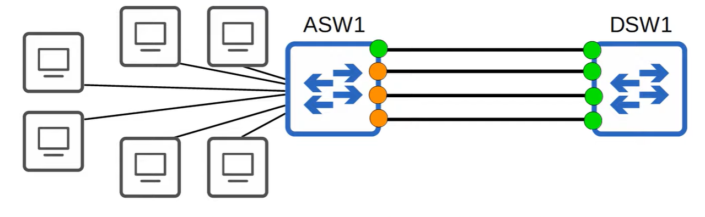
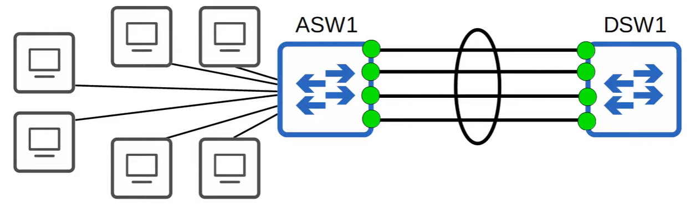
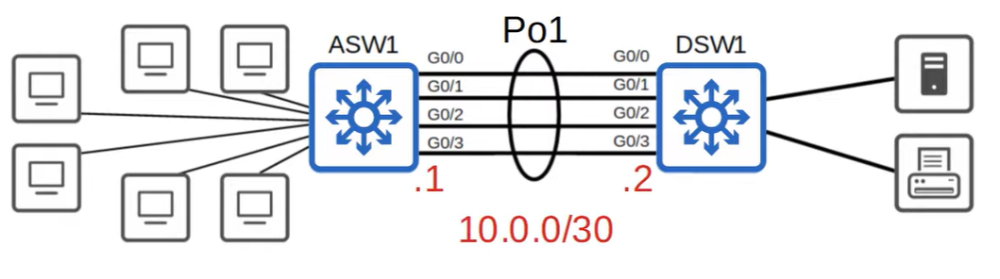

# EtherChannel



When the bandwidth of the interfaces connected to end hosts is greater than the bandwidth to the distribution swiches, it is called **oversubscription**. Some amount is acceptable, but too much will cause congestion.

* All except one links are disabled by spanning tree
* If all of ASW1's interfaces were forwarding, L2 loops would form between ASW1 and DSW2, leading to broadcast storms
* Other links will be unused unless the active link fails.



* Etherchannel represented with a circle, groups multiple interfaces together as a single interface
* STP will treat this group as a single interface
* Traffic through an EtherChannel will be load balanced among the physical interfaces in the group.
* Load balances based on flows
* A flow is communication between two nodes in the network
* Frames in the same flow will be forwarded using the same physical interfaces
* If frames in the same flow were forwarded using different physical interfaces, they may arrive out of order
* Inputs used to calculate the flow route:
    * Source MAC
    * Destination MAC
    * Source AND destination MAC
    * Source IP
    * Destination IP
    * Source AND destination IP

## Configuration
```
show etherchannel load-balance

port-channel load-balance dst-ip/dst-mac/src-dst-ip/src-dst-mac/src-ip/src-mac
```
There methods of etherchannel configuration:
* PAgP
    * Cisco propietary protocol
    * Dynamically negotiates the creation/maintenance of the EtherChannel (like DTP for trunks)
* LACP (Link Aggregation Control Protocol)
    * Industry standard protocol (IEEE 802.3ad)
    * Dynamically negotiates the creation/maintenance of the EtherChannel (like DTP for trunks)
    * Preferred method
* Static EtherChannel
    * A protocol isnt used to determing if an etherchannel should be formed
    * Interfaces are statically configured to form an etherchannel
* Up to 8 interfaces can be formed into a single EtherChannel (LACP allows 16, but 8 will be on standby)

```
interface range g0/0 - 3
channel-group 1 mode active/auto/desirable/on/passive

do show ip interface brief
```

* Channel group number has to match for member interfaces on the same switch. However it doesnt have to match the channel group number on the other switch.

```
interface port-channel 1
switchport trunk encapsulation dot1q
switchport mode trunk
do show interfaces trunk
```

* Member interfaces must have matching configurations
    * same duplex
    * same speed
    * same switchport port (access/trunk)
    * same allowed VLANs/native VLAN
* Otherwise will be excluded from the etherchannel group

Can verify etherchannel view:
```
show etherchannel summary

show etherchannel port-channel
```

## Layer 3 EtherChannel



* Routed ports (L3 ports) dont need STP, they dont create broadcast storms.
```
int range g0/0 - 3
no switchport  # makes them L3 interfaces
channel-group 1 mode access

int po1
ip address 10.0.0.1 255.255.255.252

do sh etherchannel summary
show ip interface brief
```