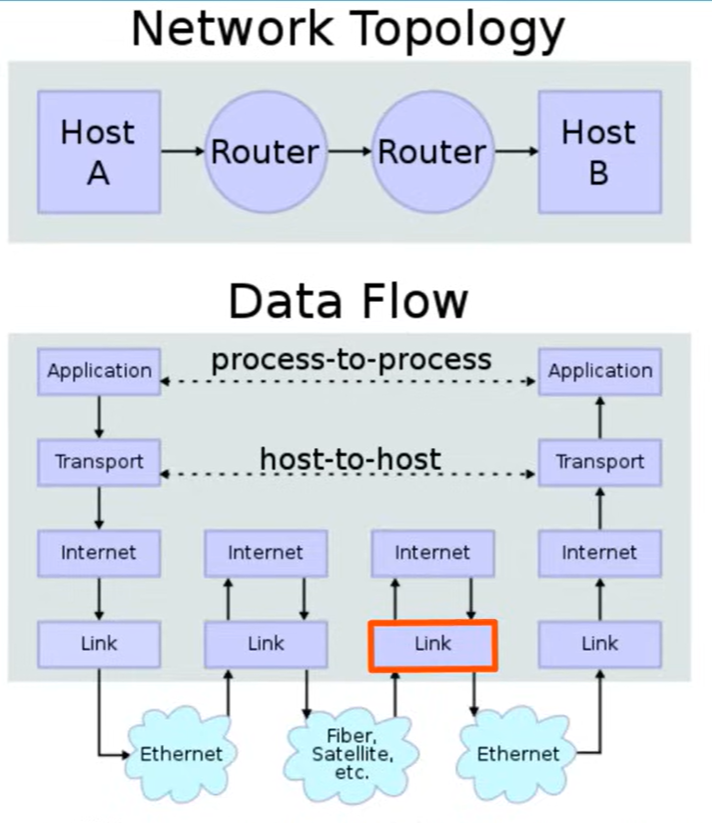

# Networking model

Networking models categorize and provide a structure for networking protocols (not hardware) and standards. A protocol is a set of logical  rules definint how network devices and software should work.

# OSI Model

Open systems interconnection model
* Conceptual model that categorizes and standerdizes the different functions in a network
* Divided into 7 layers

7. Application
* Layer closest to the end user
* Interacts with software applications, for example in your web browser.
* HTTP and HTTPs are layer 7 protocols
* Functions of layer 7 include:
    * Identifying communication partners
    * Synchronizing communication
6. Presentation
* Data in the application is in the application format
* Needs to be translation to a different format to be sent over the network
* The presentation layers job is to translate between application and network formats
* For example, encryption of data as it is sent and decryption as it is received
* Translates between different application layer formats
5. Session
* Controls dialogues (sessions) between communicating hosts
* Establises, manages and terminates connections between the local application (i.e. web browser) and the remote application (i.e. youtube)
4. Transport
* Adds a L4 header
* Segments and reassembles data for communications between end hosts
* Break large pieces of data into smaller segments which can be more easily sent over the network and are less likely to cause transmission problems if error occurs.
* Provides host-to-host, end-to-end or process to process communication.
* Data + L4 header is called a session
3. Network
* Adds a L3 header
* Provides connectivity between end hosts on different networks (i.e. outside of the LAN)
* Provides logicial addressing (ip addresses)
* Provides path selection between source and destination
* Routers operate at layer 3
* Data + L4 header + L3 header is called a packet
2. Data link
* Adds a L2 trailer and header
* Provides node to node connectivity and data transfer (for example, PC to switch, switch to router, router to router)
* Defines how data is formatted over a physical medium (for example, copper UTP cables)
* Detects and possibly corrects physical layer errors
* Uses layer 2 addressing, separate from layer 3 addressing
* Switches operate at layer 2
* Data + L4 header + L3 Header + L2 trailer/header is called a frame
1. Physical
* Defines physical characteristics of the medium used to transfer data between devices
* For example, voltage level, maximum transmission distances, physical connectors, cable specifications
* Digital bits are converted into electrical or radio signals

A data/segment/packet/frame is called a protocol data unit (PDU).

Going down the stack is called encapsulation, and up the stack is called de-encapsulation.
Going along the same layer is called same-layer interaction.

## Acronyms

All people seem to need data processing

Please do not teach students pointless acronyms

# TCP/IP

4. Application
3. Transport
2. Internet
1. Link

