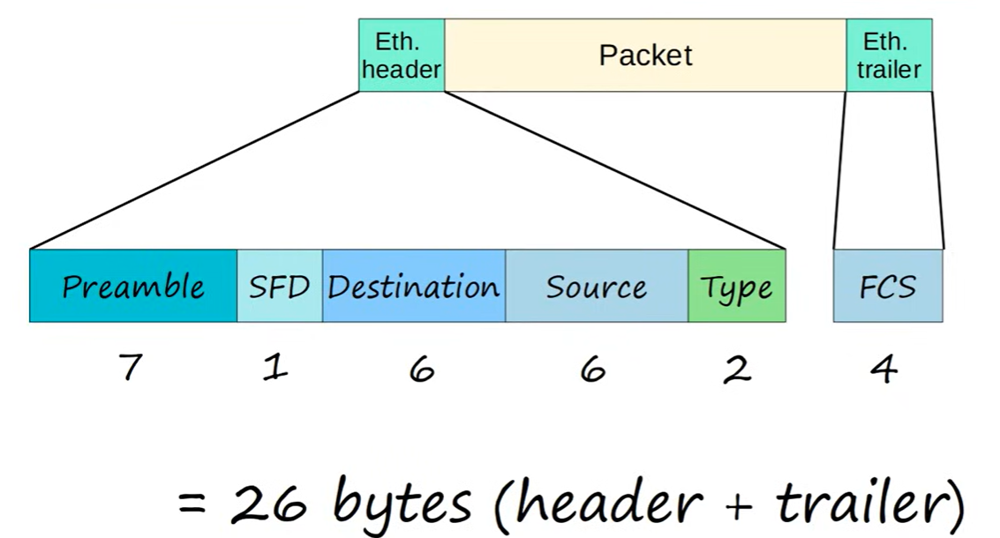
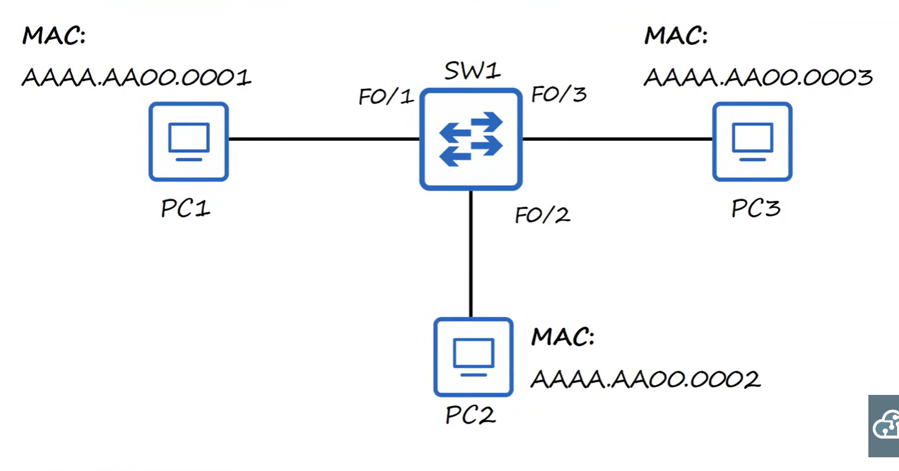

# Ethernet LAN Switching

In the ehthernet header, there is the preable then the SFD (Start frame delimiter), then the desintaiton, then the source and the type.

In the ethernet trailer, there is the FCS (Frame check sequence).

## Ethernet Frame
### Preamble

* 76 bytes
* Alternating 1's and 0's
* Allows devices to synchronize their receiver clocks

### SFC

* 1 Byte (8 bits)
* 10101011
* Marks the end of the preamble and the start of the rest of the frame

### Destination and Source
* Indicate the devices sending and receiving the frame
* Consist of the desination and source MAC addresses
* MAC = Media access control
* MAC is a 6 byte address of the physical device, assigned to the device when it is made

### Type/Length

* 2 bytes
* If the value is 1500 or less, then it is the length of the packet in bytes
* A value of 1536 or greater is the type of the packet (IPv4 or IPv6), length is determined via other methods
* 0x0800 (2048) is IPv4
* 0x86DD (34525) is IPv6

### Frame Check Sequence (FCS)

* 4 bytes
* Detect corrupted data by running a CRC (cyclic redundancy check) algorithm over the received data

## MAC Address

* 6 byte physical address assigned to the device when it is made
* Also known as burned in address
* Globally unique
* The first three bytes are the OUI (Organizationally unique identifier) which is assigned to the company making the device
* The last 3 bytes are unique to the device it's self
* Written as 12 hexadecimal characters

Unicast frame is a frame destined for a single target

PC1 sends a frame to switch 1
Switch 1 receives the frame, reads the source mac address from the frame to learn where PC1 is, accociating the MAC address to the interface in the MAC address table (dynamically learned MAC address, not manually configured).

The destination of the frame (AAAA.AA00.0002) is not yet known by the switch, so it is an unknown unicast frame. So it floods the frame, forwarding the frame through all the interfaces. PC3 ignores the packet, but PC2 receives the packet. If PC2 wants to send a reply to PC1, it sends a frame through its network interface to the switch. The switch adds the mac address to the MAC address table. This time, the switch doesnt flood the frame as it already knows which interface the mac address is on. This is a known unicase frame.

Dynamic MAC addresses are removed from the MAC address table after 5 minutes of inactivity.

