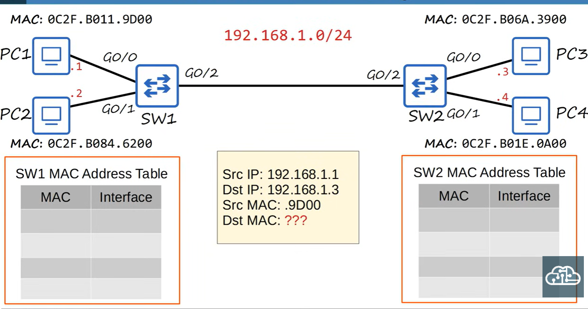
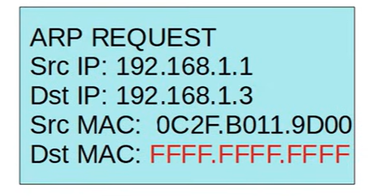
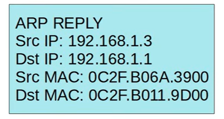
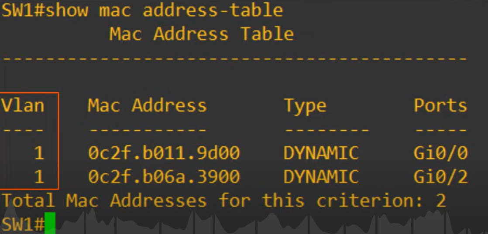

# Ethernet LAN Switching

The preamble + SFD is usually not considered part of the ethernet header, therefore the ethernet header + trailer is 18 bytes (destination 6 bytes, source 6 bytes, type 2 bytes, FCS 4 bytes).

The minimum size of a ethernet frame is 64 bytes. 64 bytes - 18 bytes is 46 bytes. Therefore the minimum payload is 46 bytes. If you send less than 46 bytes, padding 0 bytes are added.

## IP Routing



PC1 wants to send data to PC3 but it only knows the IP address, not MAC address. To find the MAC address it uses ARP (Address resolution protocol).

### ARP - Address resolution protocol
* Used to discover the layer 2 address (MAC address) of the known layer 3 address (IP Address)
* Consists of two messages:
    * ARP Request
    * ARP Reply
* ARP Request is sent as a broadcast ethernet frame, sent to all hosts on the network
* ARP Reply is unicast

ARP Request:

ARP Reply:


When the ARP reply is received, its added to the ARP table:
```
(base) PS C:\Users\tom.mclean> arp -a

Interface: 172.22.208.1 --- 0x11
  Internet Address      Physical Address      Type
  172.22.223.255        ff-ff-ff-ff-ff-ff     static
  224.0.0.0             01-00-5e-00-00-00     static
  224.0.0.22            01-00-5e-00-00-16     static
  224.0.0.251           01-00-5e-00-00-fb     static
  224.0.0.252           01-00-5e-00-00-fc     static
  230.0.0.1             01-00-5e-00-00-01     static
  239.255.255.250       01-00-5e-7f-ff-fa     static
  239.255.255.251       01-00-5e-7f-ff-fb     static
  255.255.255.255       ff-ff-ff-ff-ff-ff     static

Interface: 192.168.1.193 --- 0x13
  Internet Address      Physical Address      Type
  192.168.1.92          6c-ad-f8-73-b6-a7     dynamic
  192.168.1.254         70-97-41-52-58-c0     dynamic
  192.168.1.255         ff-ff-ff-ff-ff-ff     static
  224.0.0.22            01-00-5e-00-00-16     static
  224.0.0.251           01-00-5e-00-00-fb     static
  224.0.0.252           01-00-5e-00-00-fc     static
  230.0.0.1             01-00-5e-00-00-01     static
  255.255.255.255       ff-ff-ff-ff-ff-ff     static
```
A static entry was not learned, a dynamic one was learned via ARP.

In cisco, the command is `show arp`

## Ping

* Network utility to test reachability
* Measures rount trip time
* Uses two messages:
    * ICMP echo request
    * ICMP echo reply

## MAC Address Table



* VLAN: virutal local area network
* Type: Dynamic or static mac address
* Ports: Interfaces that the mac addresses are reachable by

