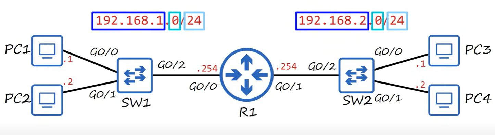
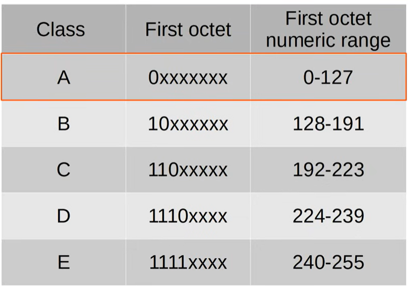
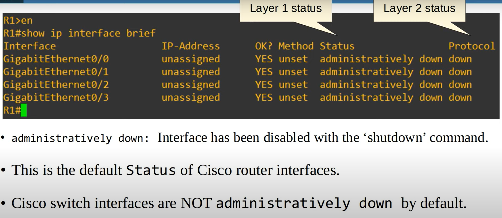

# IPv4 Addressing

A switch expands a single network, but a router creates multiple networks



A router needs an ip address for each network it is connected to (192.168.1.254 and 192.168.2.254).

## IPv4 Addresss

Example:

192.168.1.254

Split into 4 chunks of 8 bits (octets), separated by a dot, called dotted decimal.

```
11000000 10101000 00000001 11111110
192      168      1        254      /24
```

The `/24` means the first 24 bits (first 3 octets) are the network portion of the ip address, and the remaining is the host portion

## IPv4 Address Classes



Addresses in class D are multicast addresses. Class E are experimental.

Class A is normally considered up to 126, not 127. 127 is reserved for loopback (127.0.0.0 to 127.255.255.255). Used to test the network stack (OSI, TCP/IP model) on the local device.

Class A addresses are /8 prefix, class B are /16 and class C are /24. Class A has fewer possible network portions, but many possible hosts. Class C has many networks, but few hosts.

## Netmask
```
Class A -> /8  -> 255.0.0.0
Class B -> /16 -> 255.255.0.0
Class C -> /24 -> 255.255.255.0
```

## Network address

If the host portion of the address is all 0's, it is the network address (i.e. 192.168.1.0/24). The network address cannot be assigned to a host, the first useable address is 192.168.1.1/24.

If the host portion of the address is all 1's, it is the broadcass address, which cannot be assigned to a host (i.e. 192.168.1.254/24).



