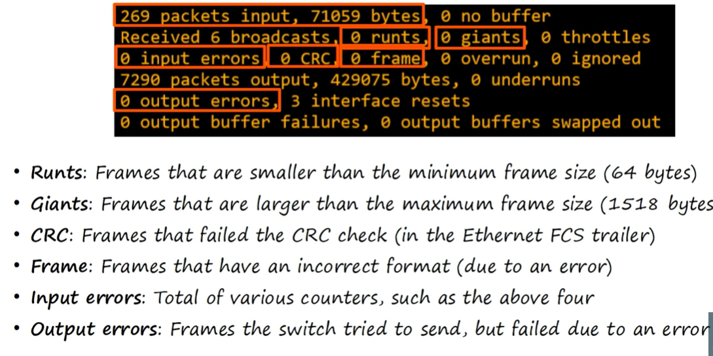

# Switch Interfaces

## Full/Half duplex

* Half duplex: the device cannot send and receive data at the same time. If it is receiving a frame, it must wait before sending a frame.
* Full duplex: The device can send and recevie data at the same time. In modern network that use switches, all devices can use full duplex.

## LAN hubs

LAN hubs are like switches, but always broadcast packets. 


## CSMA/CD

Carrier sense multiple access with collision detection. Before sending frames, devices listen to the collision domain until they detect that other devices are not sending. If a collision does occur, the device sends a jamming signal to inform the other devices that a collision happened. Each device will wait a random period of time before sending frames again. The process repeats.

## Collision domains


Switches operate at layer 2, using layer 2 addressing (mac addresses) to send packets to specific hosts. They wont try to send two frames to the same host at once.

## Speed/Duplex Autonegotiation

Interfaces that can run at different speeds (10/100 or 10/100/1000) have default settings of speed auto and duplex auto. Interfaces adverise their speed capabilities to the neighbouring device and they negotiate the best speed and duplex settings they are both capable of.


If autonegotation is disabled on the device connected to the switch, for the speed the switch will try do sense the speed that the other device is operating at. If it fails to sense the speed, it will use the slowest supported speed. For duplex, if the speed is 10 or 100 Mbps, the switch will use half duplex, else it will use full duplex.


In this example, there is a duplex mismatch, which will result in collisions. So Autonegotiation should be used where possible.

## Interface errors

```
show interfaces
```
